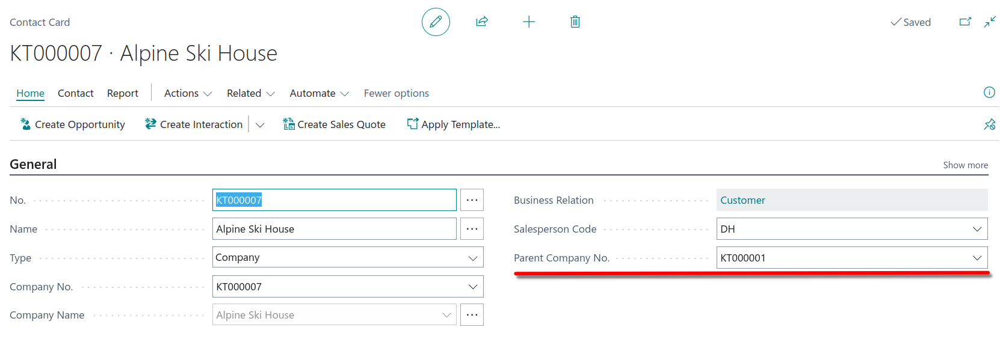
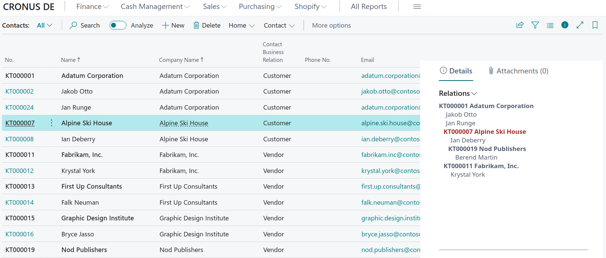
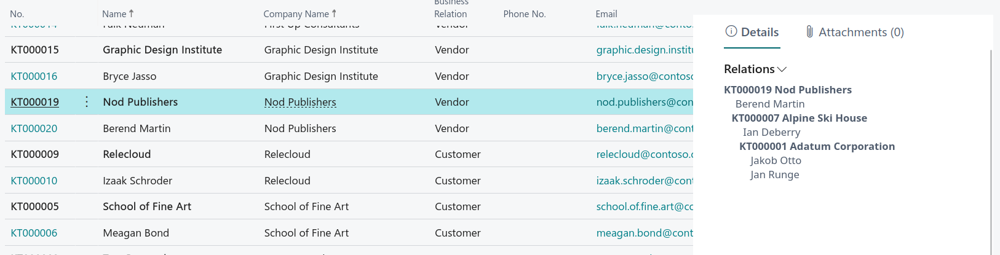

This is an extension for [Microsoft Dynamics 365 Business Central](https://dynamics.microsoft.com/en-us/business-central/overview/). It adds an functionality to build parent-child relations between company contacts. Therefore an new field *Parent Company No.* is added to the contact table where you can enter the related contact no.

The extension also adds two custom control addins which display the related contacts in a tree. The first one displays all parent and child related contacts for the selected contact in the contact list.

The second displays the parent relations only.

You can open all related contact cards (company, person) by clicking on them in the tree.

The custom control addins are written in javascript with the help of the svelte framework. Sources for the addins are provided in this project in the [Addin](./Addin) and [TreeAddin](./TreeAddin) folders.